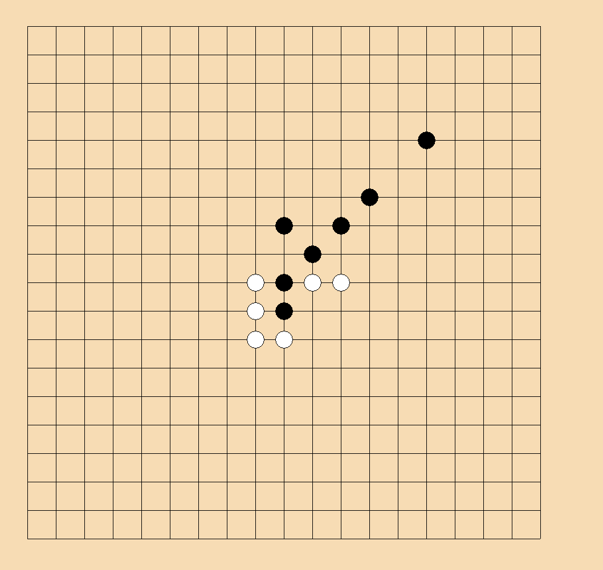

# AlphaConnect6
## Introduce
[Connect6](https://en.wikipedia.org/wiki/Connect6) is similar to tictactoe or GO. The difficulty of connect6 is easier than Go, but the number of cases is very high. So, we try to solve this problem with reinforcement learnng. 
This project refer to DeepMind's 2016 Nature publication, "Mastering the game of Go with deep neural networks and tree search," details of which can be found [on their website](http://deepmind.com/alpha-go.html).

## Rule
Two players, Black and White, alternately place two stones of their own colour, black and white respectively, on empty intersections of a Go-like board, except that Black (the first player) places one stone only for the first move. The one who gets six or more stones in a row (horizontally, vertically or diagonally) first wins the game.

## Member

## Current project status
developing..

